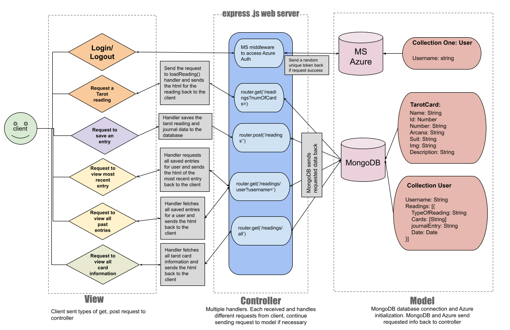

<h1>INFO 441 Project: Daily Tarot Card Reader and Journal</h1>

Gisele Fox, Emiri Nishizawa, Wenyi Sun

Our project will be a daily Tarot Card reader that allows users to see a card every day as well as add journal entries.

<h2>Update</h2>

This below URL link is expired due to logging out of UW orgnization in Microsoft Azure, please use Localhost while testing this web application after npm start command on terminal

<a href="https://localhost:3000">https://localhost:3000</a>

~~<h2>URL to our site</h2>~~
~~
<a href="https://info441-au22-tarotstoday.azurewebsites.net/">https://info441-au22-tarotstoday.azurewebsites.net/</a>
~~

<h2>Project Description</h2>

Our overall target audience would be anybody. Ideally, our project ends up being something that anyone can access and play with easily. More specifically, we would be targetting people that are interested in Tarot. These people would be our main users - people that are invested in seeing how Tarot card readings can help them sort out patterns in different parts of their lives. A reach audience would be people who are interested in astrology, as they tend to gravitate towards Tarot as well.

In terms of our overall project, general people would want to use our application to do a simple tasks everyday for fun. This build from the popularity of Wordle, a daily word guessing game. As noted from many Wordle players, the simpleness of the game made the daily task enjoyable, bringing players back everyday. Additionally, this application gives everyone a way to engage with Tarot as well as create communities within them. It would allow people without Tarot decks or those who can't meet in person to interact. Tarot enthusiasts can find their community online through our application. Overall, our application would provide a fun and easy way to log daily Tarot readings and recall past readings.

As developers, we want to build this application as it provides a fun way to engage with people. Although we are not extremely into Tarot, the cards and readings serve as a conversation starter, and can be interesting. On the development side, we find it easy to start with a minimum viable product and build off of it. Additional features can be added constantly to make the application interesting. We would easily be able to add onto our project and grow it. As a long reach goal, our project could provide a Tarot API for others to use as well. 

<h2>Technical Description</h2>

### Architectural Diagram

### Summary Table

| Priority | User | Description | Techinical Implementation |
|----------|------|-------------|---------------------------|
|P0| As a user | I'd like to request a tarot card every day and receive information about the card. | When user request a tarot card, send a request to **Mongodb** to pick a card at random, and send the result back to the client through a handler. Meanwhile, save this result in Mongodb with a unique user id and date.|
|P1| As a user | I want to create and log in my account at the Tarot website.| When user need to create an account, log in, and log out, use **Microsoft Azure** to implement the authentication|
|P1| As a user | I want to only have one drawing per day. | Obtain the date from the browser and ensure that when the user tries to draw a card, there is no drawing data for the user on that same date. |
|P2| As a user | I  want to be able to draw different types of tarot readings (for example, ones with multiple cards) | When a user requests a tarot reading, send a request to **Mongodb** to pull a radnom assortment of cards depending on the type of readings, and send the result back to the client through a handler. Meanwhile, save this result in Mongodb with a unique user id, reading id, and date.|
|P3| As a user | I want to look at past readings I have drawn | When user requests past readings, send a request to **Mongodb** which sends back the full list of tarot readings, and send the result back to client through a handler. |
|P4| As a user | I want to log a journal entry with a reading | When a user creates a jounal entry, send the input back to server and save it along with the tarot reading in **Mongodb**. |
|P5| As a user | I want to review my past jounal entries | When users request to view  past jounal, the server make a reqeust to the database and sends the target result back to client |

